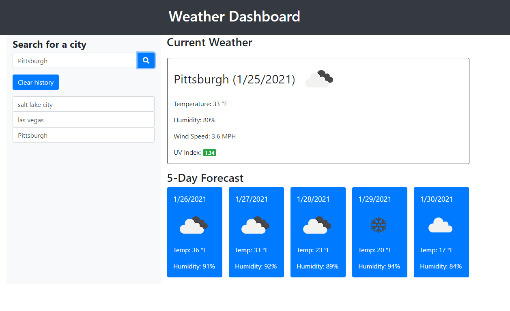

# Weather Dashboard
## 5 day forcast
  
### Description

This app will use the OpenWeather API to retrieve weather data for requested cities. This dashboard displays the current temparature, wind speed, humidity, and UV index. Along with a 5 day forcast for your selected city. The cities you search will be in your history on the left hand side of the page, you can clear that search history with the button on the screen.
When a user initiates the webpage, the OpenWeatherMap API will lookup their coordinates. By allowing location tracker to run, their current location will be output into the Weather Dashboard.
The 5-Day Forecast will show the next 5 days after the current day in individual cards. Each card will have the date, the weather picture, temperature, and humidity.

  
Links
[Live Site](https://asherpappas.github.io/WeatherDashboard/)
 
[Repo](https://github.com/AsherPappas/WeatherDashboard)
 
  
Screenshots

 
